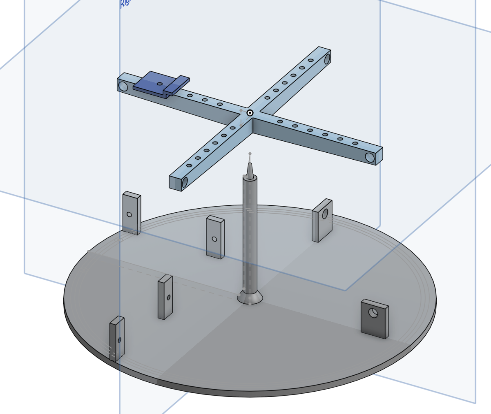

# raspberrypi_fast_steering_mirror

While commercial fast beam steering solutions exist, there is not a simple cheap solution available to the open source community. The project is part of the photonic insecticides movement (https://photonicinsecticides.com) which aims to prevent the extinction of insects.

## Very cheap version with toy servos (cost = 5 euro)

[video 1](https://www.youtube.com/shorts/W5gDEPCPxdw)
[video 2](https://www.youtube.com/shorts/TYv_WdsBpbU)

Step files are available in this repo. The onshape model can be downloaded here: 
[onshape 3d model](https://cad.onshape.com/documents/42a994e21e26fad8b3460b75/w/7cf62af59e25260f99a73d94/e/b8c9f3caf367e97fbe915c99?renderMode=0&uiState=67f4ea855562354194014e0c)
(*) hard to get working link, search for 'Budget FSM' in the onshape public models listing.

The pivot point performs reliably even when fabricated using basic 3D-printed PLA. This design employs two servos with individual pulleys that pull on one end of the mirror, while a rubber band provides the opposing force. This configuration eliminates gear slack and maps the servo range to a very narrow span, delivering high resolution. Furthermore, thanks to the significant pulley reduction, the servos exert minimal force—extending their lifespan—and allow the rubber band to maintain high tension, resulting in a swift mirror response.
It is crucial to choose a fishing wire that does not stretch. Braided wires are ideal for this purpose; for example, I used Seashark Fishing Line (8-Strand, Super Strong, Abrasion Resistant, available in a 6lb–80lb range, with specifications such as Red, 30lb, 0.25mm, 100m).
The 3D-printable STEP files are available in this repository. The mirror’s expected latency is approximately 20 ms (due to a 50 Hz PWM delay) plus an additional 1 ms for physical movement.

A faster version, with more expensive servos like these: 
[kstservo](https://kstservos.com/collections/helicopter-servos/products/ds215mg-v3-0-digital-metal-gear-micro-servo-3-70kg-cm-0-05sec-for-rc-glider-helicopters)
can hopefully be built in the near future, these would have a latency of 3 ms + 0.5 ms.
When modifying the servo´s by removng the potentiometer and driving the motor directly, a latency of 0.5 ms may be possible.

First surface mirrors are recomended for good optical performence:
[first surface](https://www.edmundoptics.eu/f/first-surface-mirrors/12017/?gad_source=1&gbraid=0AAAAAC6ham1_zjsctIsKr9nlJhu_DgT8E&gclid=CjwKCAjwktO_BhBrEiwAV70jXqvnrjsGfTxdORm-gM6R0VfZ8uMo2aSqY1ZaixHEq3UESwjONfnWnRoC2igQAvD_BwE)

More advanced users may use ultra thin mirrors, making the inirtia small and leading to faster mirror movements.
[ultra thin first surface](https://www.edmundoptics.eu/f/ultra-thin-first-surface-mirrors/40105/)

## Related projects

Fast framerates an tracking on raspberry pi: https://github.com/nickreyntjens/500_fps_raspberry_pi_global_shutter_cam

Laser safety calculator: https://github.com/nickreyntjens/laser_safety_calculator.py
(shows that with correct focal lenght, 1550 nm is safe for eyes at small nominal safety zones)

